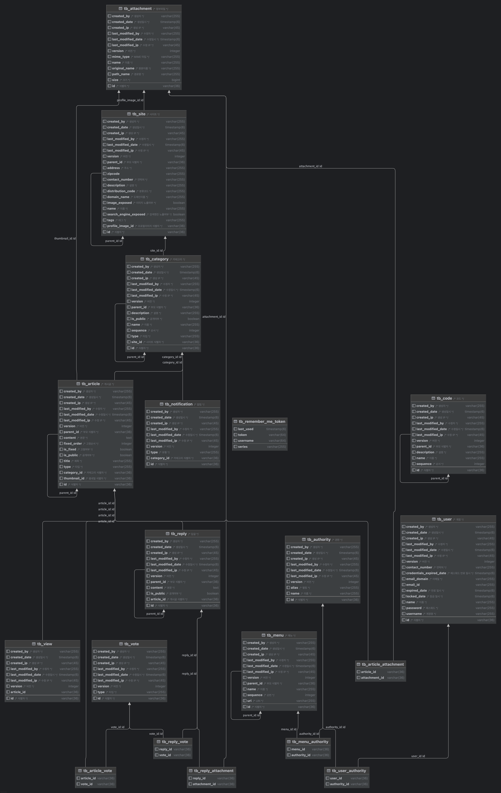
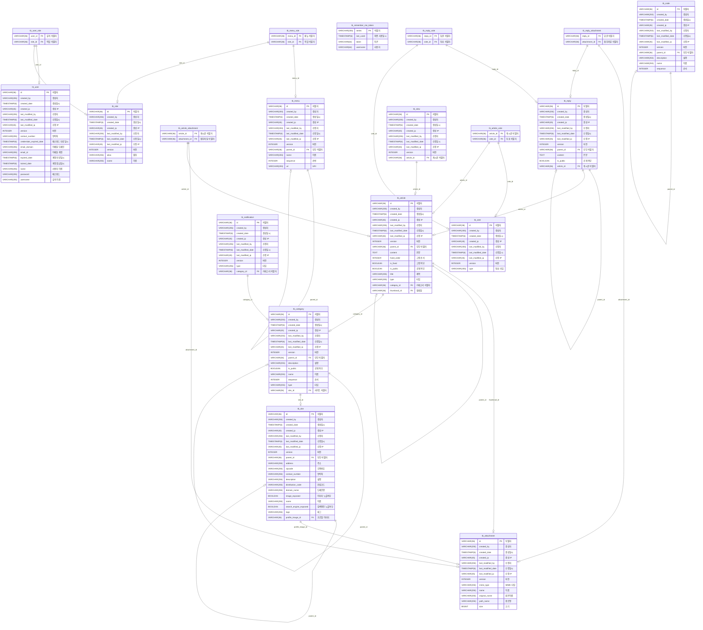
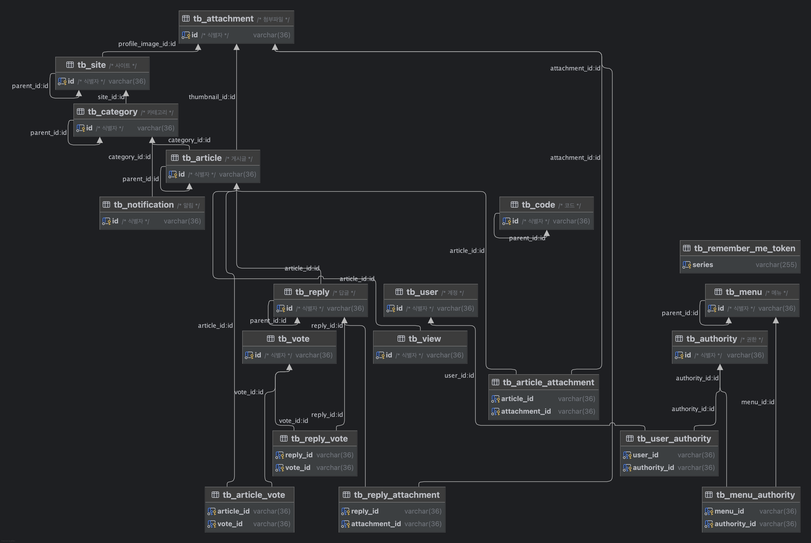

### ERD

---

```mermaid
erDiagram
    tb_attachment {
        VARCHAR(36) id PK "식별자"
        VARCHAR(255) created_by "생성자"
        TIMESTAMP(6) created_date "생성일시"
        VARCHAR(45) created_ip "생성 IP"
        VARCHAR(255) last_modified_by "수정자"
        TIMESTAMP(6) last_modified_date "수정일시"
        VARCHAR(45) last_modified_ip "수정 IP"
        INTEGER version "버전"
        VARCHAR(255) mime_type "MIME 타입"
        VARCHAR(255) name "이름"
        VARCHAR(255) original_name "원본이름"
        VARCHAR(255) path_name "경로명"
        BIGINT size "크기"
    }

    tb_role {
        VARCHAR(36) id PK "식별자"
        VARCHAR(255) created_by "생성자"
        TIMESTAMP(6) created_date "생성일시"
        VARCHAR(45) created_ip "생성 IP"
        VARCHAR(255) last_modified_by "수정자"
        TIMESTAMP(6) last_modified_date "수정일시"
        VARCHAR(45) last_modified_ip "수정 IP"
        INTEGER version "버전"
        VARCHAR(255) alias "별칭"
        VARCHAR(255) name "이름"
    }

    tb_code {
        VARCHAR(36) id PK "식별자"
        VARCHAR(255) created_by "생성자"
        TIMESTAMP(6) created_date "생성일시"
        VARCHAR(45) created_ip "생성 IP"
        VARCHAR(255) last_modified_by "수정자"
        TIMESTAMP(6) last_modified_date "수정일시"
        VARCHAR(45) last_modified_ip "수정 IP"
        INTEGER version "버전"
        VARCHAR(36) parent_id FK "부모 식별자"
        VARCHAR(255) description "설명"
        VARCHAR(255) name "이름"
        INTEGER sequence "순서"
    }

    tb_menu {
        VARCHAR(36) id PK "식별자"
        VARCHAR(255) created_by "생성자"
        TIMESTAMP(6) created_date "생성일시"
        VARCHAR(45) created_ip "생성 IP"
        VARCHAR(255) last_modified_by "수정자"
        TIMESTAMP(6) last_modified_date "수정일시"
        VARCHAR(45) last_modified_ip "수정 IP"
        INTEGER version "버전"
        VARCHAR(36) parent_id FK "부모 식별자"
        VARCHAR(255) name "이름"
        INTEGER sequence "순번"
        VARCHAR(255) uri "URI"
    }

    tb_menu_role {
        VARCHAR(36) menu_id FK "메뉴 식별자"
        VARCHAR(36) role_id FK "역할 식별자"
    }

    tb_remember_me_token {
        VARCHAR(255) series PK "식별자"
        TIMESTAMP(6) last_used "최종 사용일시"
        VARCHAR(64) token "토큰"
        VARCHAR(64) username "사용자"
    }

    tb_site {
        VARCHAR(36) id PK "식별자"
        VARCHAR(255) created_by "생성자"
        TIMESTAMP(6) created_date "생성일시"
        VARCHAR(45) created_ip "생성 IP"
        VARCHAR(255) last_modified_by "수정자"
        TIMESTAMP(6) last_modified_date "수정일시"
        VARCHAR(45) last_modified_ip "수정 IP"
        INTEGER version "버전"
        VARCHAR(36) parent_id FK "부모 식별자"
        VARCHAR(255) address "주소"
        VARCHAR(255) zipcode "우편번호"
        VARCHAR(255) contact_number "연락처"
        VARCHAR(255) description "설명"
        VARCHAR(255) distribution_code "분류코드"
        VARCHAR(255) domain_name "도메인명"
        BOOLEAN image_exposed "이미지 노출여부"
        VARCHAR(255) name "이름"
        BOOLEAN search_engine_exposed "검색엔진 노출여부"
        VARCHAR(255) tags "태그"
        VARCHAR(36) profile_image_id FK "프로필 이미지"
    }

    tb_category {
        VARCHAR(36) id PK "식별자"
        VARCHAR(255) created_by "생성자"
        TIMESTAMP(6) created_date "생성일시"
        VARCHAR(45) created_ip "생성 IP"
        VARCHAR(255) last_modified_by "수정자"
        TIMESTAMP(6) last_modified_date "수정일시"
        VARCHAR(45) last_modified_ip "수정 IP"
        INTEGER version "버전"
        VARCHAR(36) parent_id FK "부모 식별자"
        VARCHAR(255) description "설명"
        BOOLEAN is_public "공개 여부"
        VARCHAR(255) name "이름"
        INTEGER sequence "순서"
        VARCHAR(255) type "타입"
        VARCHAR(36) site_id FK "사이트 식별자"
    }

    tb_article {
        VARCHAR(36) id PK "식별자"
        VARCHAR(255) created_by "생성자"
        TIMESTAMP(6) created_date "생성일시"
        VARCHAR(45) created_ip "생성 IP"
        VARCHAR(255) last_modified_by "수정자"
        TIMESTAMP(6) last_modified_date "수정일시"
        VARCHAR(45) last_modified_ip "수정 IP"
        INTEGER version "버전"
        VARCHAR(36) parent_id FK "부모 식별자"
        TEXT content "본문"
        INTEGER fixed_order "고정 순서"
        BOOLEAN is_fixed "고정 여부"
        BOOLEAN is_public "공개 여부"
        VARCHAR(255) title "제목"
        VARCHAR(255) type "타입"
        VARCHAR(36) category_id FK "카테고리 식별자"
        VARCHAR(36) thumbnail_id FK "썸네일"
    }

    tb_article_attachment {
        VARCHAR(36) article_id FK "게시글 식별자"
        VARCHAR(36) attachment_id FK "첨부파일 식별자"
    }

    tb_notification {
        VARCHAR(36) id PK "식별자"
        VARCHAR(255) created_by "생성자"
        TIMESTAMP(6) created_date "생성일시"
        VARCHAR(45) created_ip "생성 IP"
        VARCHAR(255) last_modified_by "수정자"
        TIMESTAMP(6) last_modified_date "수정일시"
        VARCHAR(45) last_modified_ip "수정 IP"
        INTEGER version "버전"
        VARCHAR(255) type "타입"
        VARCHAR(36) category_id FK "카테고리 식별자"
    }

    tb_reply {
        VARCHAR(36) id PK "식별자"
        VARCHAR(255) created_by "생성자"
        TIMESTAMP(6) created_date "생성일시"
        VARCHAR(45) created_ip "생성 IP"
        VARCHAR(255) last_modified_by "수정자"
        TIMESTAMP(6) last_modified_date "수정일시"
        VARCHAR(45) last_modified_ip "수정 IP"
        INTEGER version "버전"
        VARCHAR(36) parent_id FK "부모 식별자"
        TEXT content "본문"
        BOOLEAN is_public "공개 여부"
        VARCHAR(36) article_id FK "게시글 식별자"
    }

    tb_reply_attachment {
        VARCHAR(36) reply_id FK "답글 식별자"
        VARCHAR(36) attachment_id FK "첨부파일 식별자"
    }

    tb_user {
        VARCHAR(36) id PK "식별자"
        VARCHAR(255) created_by "생성자"
        TIMESTAMP(6) created_date "생성일시"
        VARCHAR(45) created_ip "생성 IP"
        VARCHAR(255) last_modified_by "수정자"
        TIMESTAMP(6) last_modified_date "수정일시"
        VARCHAR(45) last_modified_ip "수정 IP"
        INTEGER version "버전"
        VARCHAR(255) contact_number "연락처"
        TIMESTAMP(6) credentials_expired_date "패스워드 만료일시"
        VARCHAR(255) email_domain "이메일 도메인"
        VARCHAR(255) email_id "이메일 계정"
        TIMESTAMP(6) expired_date "계정 만료일시"
        TIMESTAMP(6) locked_date "계정 잠금일시"
        VARCHAR(255) name "사용자 이름"
        VARCHAR(255) password "패스워드"
        VARCHAR(255) username "유저 이름"
    }

    tb_user_role {
        VARCHAR(36) user_id FK "유저 식별자"
        VARCHAR(36) role_id FK "역할 식별자"
    }

    tb_view {
        VARCHAR(36) id PK "식별자"
        VARCHAR(255) created_by "생성자"
        TIMESTAMP(6) created_date "생성일시"
        VARCHAR(45) created_ip "생성 IP"
        VARCHAR(255) last_modified_by "수정자"
        TIMESTAMP(6) last_modified_date "수정일시"
        VARCHAR(45) last_modified_ip "수정 IP"
        INTEGER version "버전"
        VARCHAR(36) article_id FK "게시글 식별자"
    }

    tb_vote {
        VARCHAR(36) id PK "식별자"
        VARCHAR(255) created_by "생성자"
        TIMESTAMP(6) created_date "생성일시"
        VARCHAR(45) created_ip "생성 IP"
        VARCHAR(255) last_modified_by "수정자"
        TIMESTAMP(6) last_modified_date "수정일시"
        VARCHAR(45) last_modified_ip "수정 IP"
        INTEGER version "버전"
        VARCHAR(255) type "투표 타입"
    }

    tb_article_vote {
        VARCHAR(36) article_id FK "게시글 식별자"
        VARCHAR(36) vote_id FK "투표 식별자"
    }

    tb_reply_vote {
        VARCHAR(36) reply_id FK "답글 식별자"
        VARCHAR(36) vote_id FK "투표 식별자"
    }

    tb_article ||--o| tb_attachment : "thumbnail_id"
    tb_article ||--o| tb_article : "parent_id"
    tb_article ||--o| tb_category : "category_id"
    tb_article_attachment ||--o| tb_attachment : "attachment_id"
    tb_article_attachment ||--o| tb_article : "article_id"
    tb_article_vote ||--o| tb_vote : "vote_id"
    tb_article_vote ||--o| tb_article : "article_id"
    tb_category ||--o| tb_category : "parent_id"
    tb_category ||--o| tb_site : "site_id"
    tb_code ||--o| tb_code : "parent_id"
    tb_menu ||--o| tb_menu : "parent_id"
    tb_menu_role ||--o| tb_menu : "menu_id"
    tb_menu_role ||--o| tb_role : "role_id"
    tb_notification ||--o| tb_category : "category_id"
    tb_reply ||--o| tb_reply : "parent_id"
    tb_reply ||--o| tb_article : "article_id"
    tb_reply_attachment ||--o| tb_attachment : "attachment_id"
    tb_reply_attachment ||--o| tb_reply : "reply_id"
    tb_reply_vote ||--o| tb_reply : "reply_id"
    tb_reply_vote ||--o| tb_vote : "vote_id"
    tb_site ||--o| tb_site : "parent_id"
    tb_site ||--o| tb_attachment : "profile_image_id"
    tb_user_role ||--o| tb_user : "user_id"
    tb_user_role ||--o| tb_role : "role_id"
    tb_view ||--o| tb_article : "article_id"


```

### ERD 간소화

