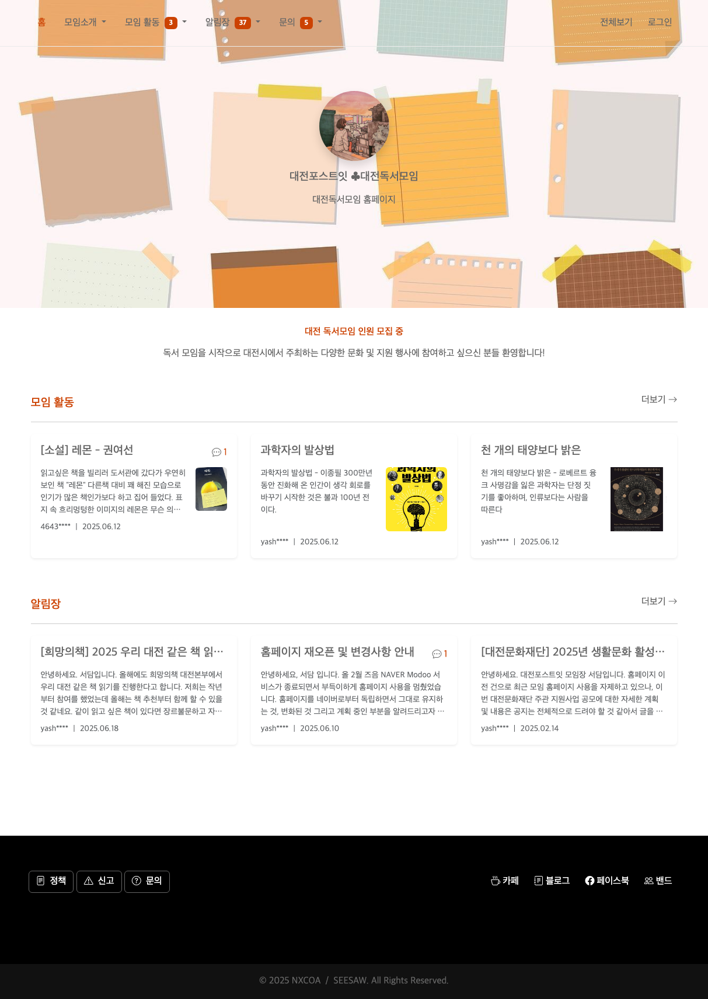

# SEESAW WEB

## 프로젝트 소개
SEESAW WEB는 SEESAW CMS로 만들어낸 포털 웹사이트입니다. 게시글, 정적 콘텐츠, 캘린더, 주문, 예약, 상품 등록 등 모듈을 추가하여 게시할 수 있습니다. 현재는 게시글, 정적 콘텐츠 모듈만 구현된 상태입니다.

## 개발 환경 설정

### 개발 환경 설정 가이드
[개발 환경 설정 가이드](docs/DEVELOPMENT_SETUP.md)

### 버저닝
[소프트웨어 버전 관리 가이드](./docs/versioning.md)

## 배포 정보
현재 프로젝트는 다음 URL에서 운영 배포 중입니다:
- [대전포스트잇 포털](https://daejeonstickybook.seesaw.me.kr)

### 배포 절차
- [Production Release 워크플로우](./docs/PROD_RELEASE_WORKFLOW.md) - GitHub Actions를 사용한 배포 절차 시각화

## GitHub 템플릿 가이드

[GitHub 템플릿 가이드](docs/GITHUB_TEMPLATES.md)
