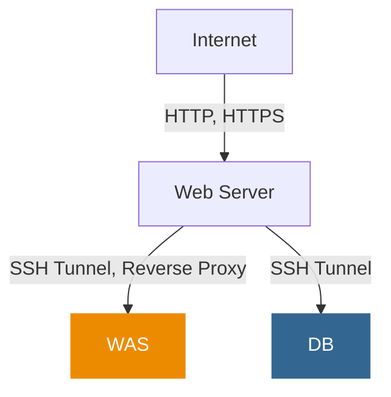

# 시스템 아키텍처 구성도

이 문서는 시스템의 아키텍처 구성도를 설명합니다.

## 네트워크 구성도

아래 다이어그램은 시스템의 네트워크 구성을 보여줍니다.

## 구성 요소 설명

### Internet

- 외부 사용자 접근 지점

### Web Server

- 역할: 정적 콘텐츠 제공 및 WAS로 요청 전달
- 애플리케이션:
  - 

### WAS (Web Application Server)

- 역할: 애플리케이션 로직 처리 및 동적 콘텐츠 생성
- 애플리케이션:
  - `seesaw-web` 
  - `seesaw-api` 
  - `seesaw-console` 

### DB (Database Server)

- 역할: 데이터 저장 및 관리
- 애플리케이션:
  - 
  - 

## 보안 고려사항

- 모든 서버 간 통신은 SSH 터널을 통해 암호화됩니다.
- 직접적인 인터넷에서 WAS나 DB로의 접근은 불가능합니다.
- Web Server만 외부 인터넷에 노출되어 있습니다.
