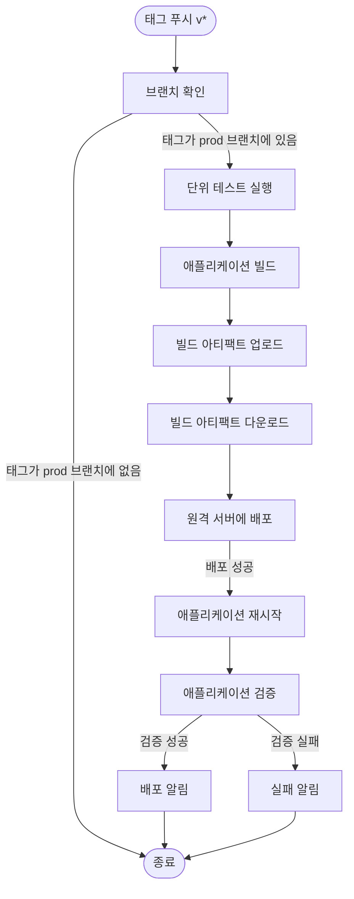
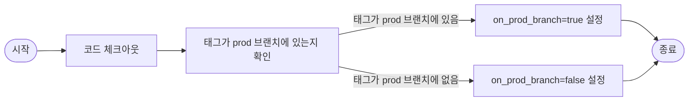
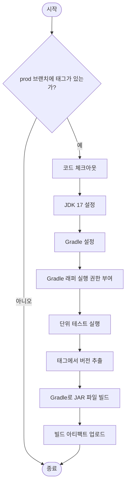
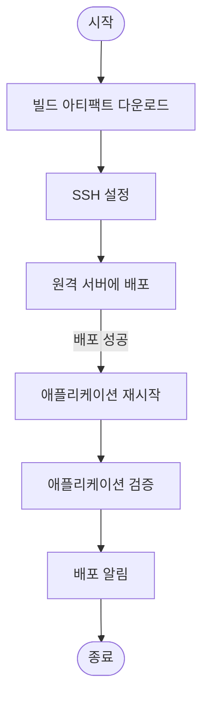

# Production Release Workflow

이 문서는 GitHub Actions를 사용한 Production Release 워크플로우의 절차를 시각화합니다.

## 워크플로우 개요

Production Release 워크플로우는 `v*` 패턴의 태그가 푸시될 때 트리거되며, 다음과 같은 주요 단계로 구성됩니다:

1. **브랜치 확인**: 태그가 prod 브랜치에 있는지 확인
2. **테스트 및 빌드**: 단위 테스트 실행 후 애플리케이션 빌드 및 JAR 파일 생성
3. **배포**: 빌드된 JAR 파일을 원격 서버에 배포
4. **검증**: 배포된 애플리케이션이 정상적으로 실행되는지 확인

## 워크플로우 다이어그램

## 상세 워크플로우 설명

### 1. 브랜치 확인 (check_branch)

- **코드 체크아웃**: 전체 Git 히스토리를 가져옴 (`fetch-depth: 0`)
- **태그 확인**: 태그가 포함된 브랜치를 확인하고 prod 브랜치에 있는지 검증
- **결과 출력**: `on_prod_branch` 출력 변수 설정

### 2. 빌드 (build)

- **조건 확인**: `check_branch` 작업의 결과가 true인 경우에만 실행
- **환경 설정**: JDK 17 및 Gradle 설정
- **단위 테스트**: Gradle을 사용하여 애플리케이션의 단위 테스트 실행
- **버전 추출**: 태그에서 버전 정보 추출 (예: v1.0.0 → 1.0.0)
- **빌드**: Gradle을 사용하여 애플리케이션 JAR 파일 생성
- **아티팩트 업로드**: 빌드된 JAR 파일을 GitHub Actions 아티팩트로 업로드

### 3. 배포 (deploy)

- **아티팩트 다운로드**: 빌드 작업에서 생성된 JAR 파일 다운로드
- **SSH 설정**: 원격 서버 접속을 위한 SSH 설정
- **파일 전송**: JAR 파일을 원격 서버로 전송
- **애플리케이션 재시작**: 기존 애플리케이션 종료 후 새 버전 시작
- **검증**: 애플리케이션이 정상적으로 실행되는지 확인
  - 프로세스 확인
  - 헬스 엔드포인트 호출 (최대 10회 재시도)
- **알림**: 배포 결과 알림

## 필요한 시크릿(Secrets) 설정

- **SSH_PRIVATE_KEY**: 원격 서버 접속을 위한 SSH 개인 키
- **REMOTE_HOST**: 원격 서버 주소
- **REMOTE_USER**: 원격 서버 접속 사용자 이름
- **REMOTE_DIR**: 원격 서버에서 애플리케이션을 배포할 디렉토리 경로

### 선택적 시크릿(Secrets) 설정

- **APP_PORT**: 애플리케이션이 실행되는 포트 (기본값: 8080)
- **HEALTH_ENDPOINT**: 애플리케이션 상태 확인 엔드포인트 (기본값: /actuator/health)
